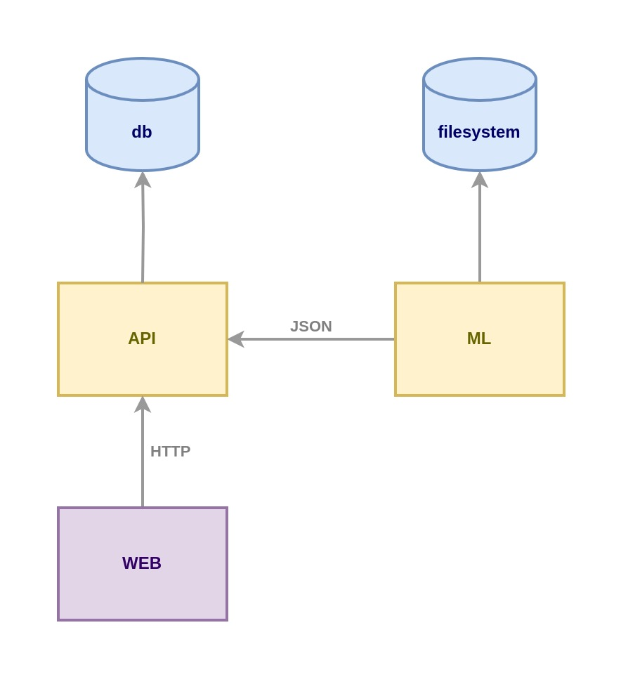

## Инфраструктура проекта


-----

# Разметка видеоконтента
***

## Системные требования
1. Python 3.11.9
2. OC: Windows
3. ОЗУ: 32 Гб с использованием файла подкачки
4. CPU: Amd Ryzen 5500U (или эквивалент от Intel)
5. Место на диске: От 60 Гб
***

## Установка и запуск

1. ~~~bash 
   git clone https://github.com/scout57/vmarkup_project.git
   ~~~
3. ~~~bash
   cd ml
   ~~~
3. Создание виртуального окружения
   ~~~bash
   python -m venv venv
   ~~~ 
4. ~~~bash
   venv\Scripts\activate
   ~~~
5. Установка зависимостей
   ~~~bash
   pip install -r requirements.txt
   ~~~
6. Запуск анализа
   ~~~bash
   python separating.py
   ~~~
***

> ### Примечание
> 1) После первого запуска программы произойдёт загрузка весов моделей
> 2) Приложение попросит полный путь к файлу для анализа

### Расположение результатов:
1. final_test_russia_V1.json
2. shot_timings_russia_V1.json
3. json_audio_scenes_russia_V1_.json
4. json_video_scenes_russia_V1_.json

# Запуск приложения для демо
***
## Системные требования
1. OC: Windows / Unix
2. ОЗУ: 4 Гб с использованием файла подкачки
3. CPU: Amd Ryzen 5500U (или эквивалент от Intel)
4. Место на диске: От 5 Гб

***
1. Настроить локальные порты
```bash
cp .env.example .env
```
2. Запустить приложения
```bash
docker compose up
```
3. Открыть страницу в браузере: http://0.0.0.0:8000